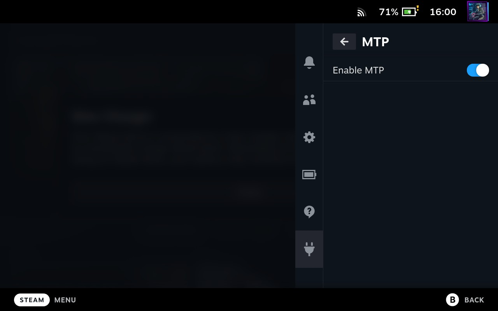

# DeckMTP

A Steam Deck plugin (for Decky Loader) to enable MTP file transfer over USB. USB cable not included.



## Installation

Install through Decky plugin store. One additional step is necessary, you need to enable DRD (Dual-Role Device)
support through the Steam Deck BIOS. Without this, it's impossible to create USB gadgets, since the USB
controller can only act as a host in that case.

To enable DRD, go into BIOS by shutting down your deck, and holding Volume Up and Power until you hear a beep.

Then, select Setup Utility, then Advanced, then USB Configuration, and finally USB Dual-Role Device. Select DRD
instead of the existing XHCI and you're set.

## Build instrutions
1. Clone the repository to use as an example for making your plugin.
2. In your clone of the repository run these commands:
   1. ``pnpm i``
   2. ``pnpm run build``
3. You should do this every time you make changes to your plugin.

Note: If you are recieveing build errors due to an out of date library, you should run this command inside of
your repository:

```bash
pnpm update decky-frontend-lib --latest
```

# License
This project is licensed under the terms of the BSD 3-Clause License. You can read the full
license text in [LICENSE](LICENSE).
